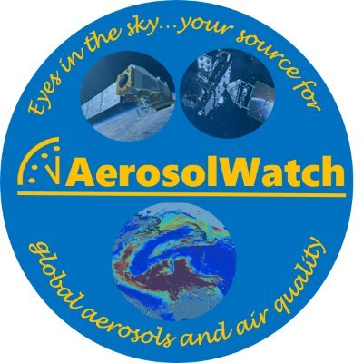

<h1>
  
  AerosolWatch Training Resources
</h1>

This GitHub repository is a resource for stakeholders who are interested in using Python to work with satellite data from the Aerosols and Atmospheric Composition Science Team at NOAA NESDIS.

THIS REPO IS UNDER CONSTRUCTION!  MORE MATERIALS ARE COMING SOON!!
